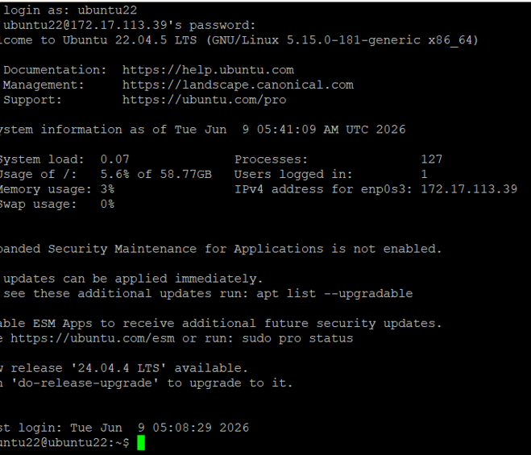
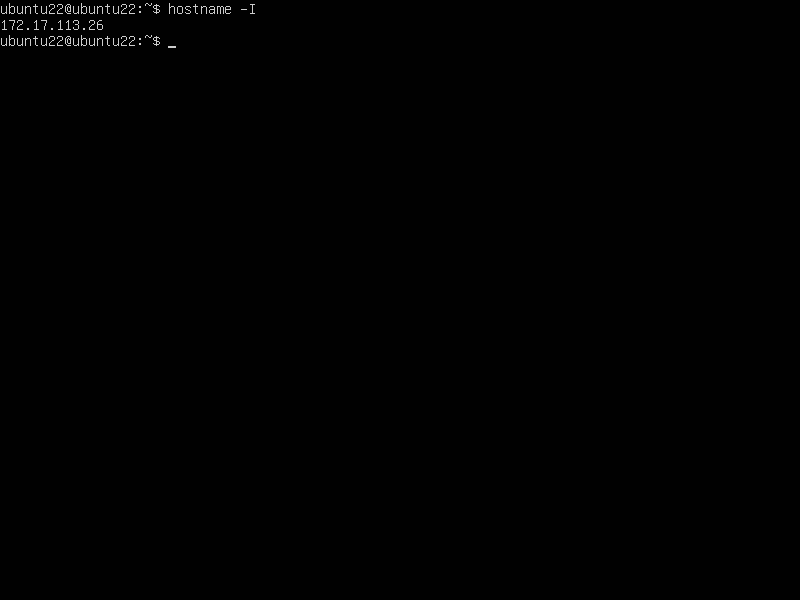
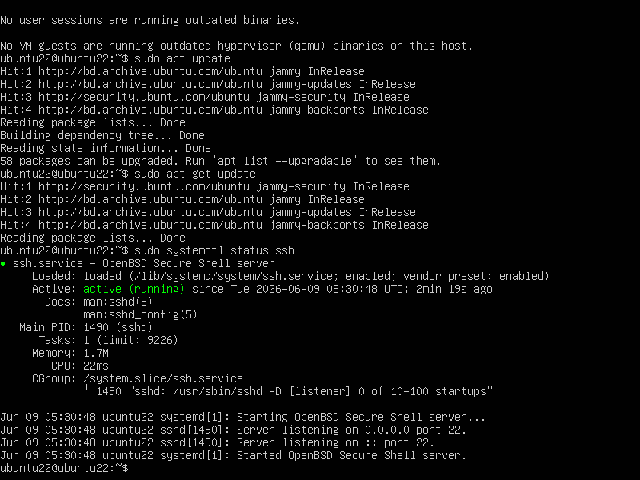
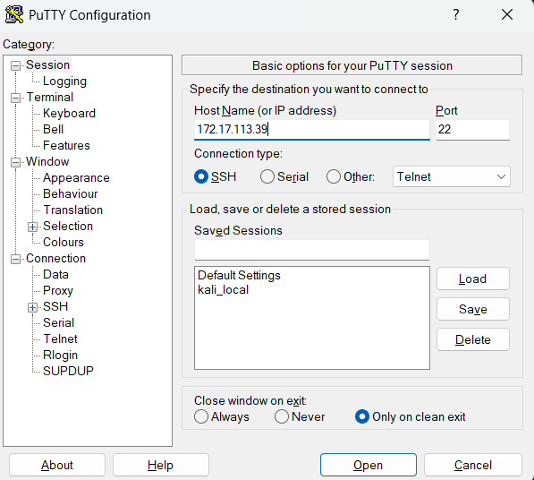
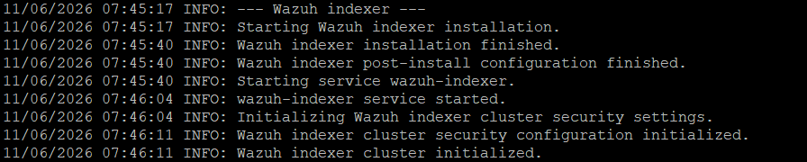
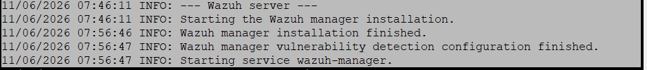
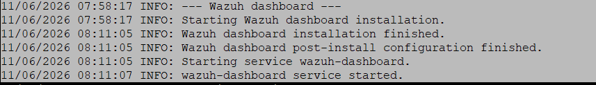
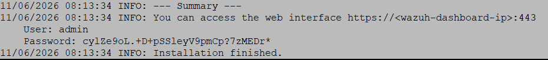
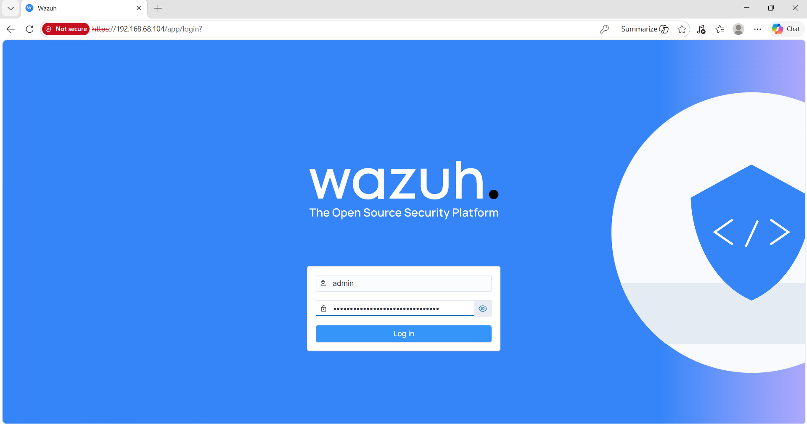
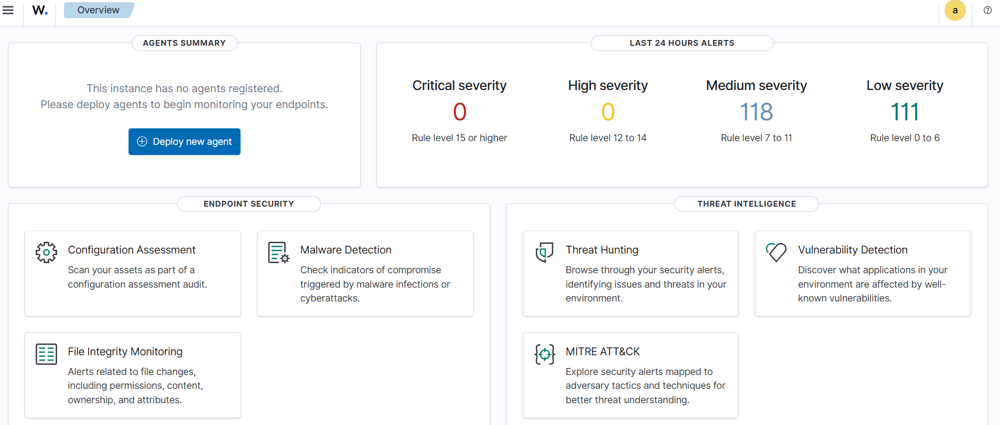

# Wazuh SIEM Installation on Ubuntu Server Using PuTTY

A complete guide to installing and configuring Wazuh Security Information and Event Management (SIEM) on Ubuntu Server with remote administration via PuTTY SSH.

---

## 📋 Table of Contents

- [Objective](#objective)
- [System Requirements](#system-requirements)
- [Prerequisites](#prerequisites)
- [Installation Steps](#installation-steps)
  - [Step 1: Ubuntu Server Setup](#step-1-ubuntu-server-setup)
  - [Step 2: Obtain IP Address](#step-2-obtain-ip-address)
  - [Step 3: Install SSH](#step-3-install-ssh)
  - [Step 4: Connect Using PuTTY](#step-4-connect-using-putty)
  - [Step 5: Install Wazuh Components](#step-5-install-wazuh-components)
  - [Step 6: Installation Verification](#step-6-installation-verification)
  - [Step 7: Access Dashboard](#step-7-access-dashboard)
- [Troubleshooting](#troubleshooting)
- [Security Recommendations](#security-recommendations)
- [Conclusion](#conclusion)

---

## 🎯 Objective

This project demonstrates the complete installation and configuration of Wazuh SIEM (Security Information and Event Management) on an Ubuntu Server with remote access capabilities using PuTTY SSH client. The setup includes all essential Wazuh components for centralized security monitoring and log analysis.

---

## 💻 System Requirements

| Requirement | Specification |
|------------|---------------|
| **Operating System** | Ubuntu Server 22.04 LTS |
| **RAM** | 8 GB minimum |
| **CPU Cores** | 4 cores minimum |
| **Disk Space** | 20 GB minimum |
| **Network** | Internet connection required |
| **Wazuh Version** | 4.13.1 |
| **SSH Client** | PuTTY (Windows) or built-in SSH (Linux/macOS) |

---

## 📦 Prerequisites

Before starting the installation, ensure you have:

- [ ] Ubuntu Server 22.04 LTS installed and running
- [ ] Virtual machine or physical server with 8GB RAM and 4 CPU cores
- [ ] Administrative (sudo) access
- [ ] Network connectivity to download packages
- [ ] PuTTY installed (for Windows users) or SSH client available
- [ ] A terminal or command line interface ready

---

## 🚀 Installation Steps

### Step 1: Ubuntu Server Setup

First, ensure your Ubuntu Server is running and accessible.

**Screenshot:**


---

### Step 2: Obtain IP Address

Retrieve the IP address of your Ubuntu Server for remote connection setup.

**Command:**
```bash
hostname -I
```

**Expected Output:**
```
192.168.68.104
```

**Screenshot:**


---

### Step 3: Install SSH

Enable remote access by installing and verifying OpenSSH Server.

**Commands:**
```bash
# Update package manager
sudo apt update

# Install OpenSSH Server
sudo apt install openssh-server -y

# Verify SSH service is running
sudo systemctl status ssh
```

**Expected Output:**
```
● ssh.service - OpenBSD Secure Shell server
     Loaded: loaded (/lib/systemd/system/ssh.service; enabled; vendor preset: enabled)
     Active: active (running)
```

**Screenshot:**


---

### Step 4: Connect Using PuTTY

Configure PuTTY on your Windows machine to connect to the Ubuntu Server.

**PuTTY Configuration:**

| Setting | Value |
|---------|-------|
| **Host Name/IP Address** | 192.168.68.104 |
| **Port** | 22 |
| **Connection Type** | SSH |
| **Default Username** | your_username |

**Steps:**
1. Open PuTTY
2. Enter the IP address in the "Host Name" field
3. Ensure port is set to 22
4. Select SSH as connection type
5. Click "Open"
6. Enter your Ubuntu credentials when prompted

**Screenshot:**


---

### Step 5: Install Wazuh Components

Install all Wazuh components using the official installation script.

**Commands:**
```bash
# Download the Wazuh installation script
curl -sO https://packages.wazuh.com/4.13/wazuh-install.sh

# Make the script executable
chmod +x wazuh-install.sh

# Run the installation script (installs all components)
sudo ./wazuh-install.sh -a
```

**Components Installed:**

| Component | Purpose |
|-----------|---------|
| **Wazuh Indexer** | Data storage and search engine |
| **Wazuh Manager** | Core security monitoring and threat detection |
| **Filebeat** | Log shipping and forwarding agent |
| **Wazuh Dashboard** | Web-based user interface and visualization |

**Installation Screenshots:**
- 
- 
- 
- 

**Note:** The installation process may take 10-15 minutes depending on your system specifications and internet speed.

---

### Step 6: Installation Verification

Verify that all Wazuh components have been installed successfully.

**Screenshot:**


**Credentials Generated:**
```
Username: admin
Password: [Generated during installation - save this securely]
```

⚠️ **Important:** Save the generated password securely. You'll need it to access the Wazuh Dashboard.

---

### Step 7: Access Dashboard

Connect to the Wazuh Dashboard using your web browser.

**Steps:**
1. Open your web browser (Chrome, Firefox, Edge, Safari)
2. Navigate to: `https://192.168.68.104`
3. Accept the SSL certificate warning (self-signed certificate)
4. Enter credentials:
   - **Username:** admin
   - **Password:** [Your generated password]
5. Click "Sign In"

**Access URL:**
```
https://192.168.68.104
```

**Login Screenshot:**


**Dashboard Home:**


---

## 📊 Wazuh Dashboard Overview

Once logged in, you'll have access to:

- **Security Events:** Real-time security monitoring and alerts
- **Log Analysis:** Centralized log collection and analysis
- **Threat Detection:** Automated threat identification
- **Compliance Reports:** Regulatory compliance monitoring
- **System Health:** Infrastructure and agent monitoring
- **Custom Dashboards:** Personalized security insights

---

## 🔧 Troubleshooting

### Issue: Cannot Connect via PuTTY

**Solutions:**
```bash
# Check SSH service status
sudo systemctl status ssh

# Restart SSH service if needed
sudo systemctl restart ssh

# Verify firewall rules
sudo ufw status

# Allow SSH through firewall (if using UFW)
sudo ufw allow 22/tcp
sudo ufw allow 443/tcp
```

### Issue: Dashboard Not Accessible

**Solutions:**
```bash
# Check if all services are running
sudo systemctl status wazuh-manager
sudo systemctl status wazuh-indexer
sudo systemctl status wazuh-dashboard

# Restart Wazuh Dashboard if needed
sudo systemctl restart wazuh-dashboard
```

### Issue: Forgotten Admin Password

```bash
# Reset admin password
sudo ./wazuh-install.sh -wp your_new_password
```

### Issue: SSL Certificate Warning

This is normal for self-signed certificates. You can:
- Accept the certificate warning and continue (development)
- Install a valid SSL certificate (production)

---

## 🔒 Security Recommendations

### For Production Environments:

1. **Change Default Credentials**
   ```bash
   # Update admin password
   sudo ./wazuh-install.sh -wp new_secure_password
   ```

2. **Enable Firewall**
   ```bash
   sudo ufw enable
   sudo ufw allow 22/tcp      # SSH
   sudo ufw allow 443/tcp     # Dashboard
   sudo ufw allow 9200/tcp    # Indexer (if needed)
   ```

3. **Install Valid SSL Certificate**
   - Replace self-signed certificates with valid ones
   - Use Let's Encrypt for free SSL certificates

4. **Configure SSH Key Authentication**
   - Disable password authentication
   - Use SSH keys instead of passwords
   - Restrict SSH access to specific IPs

5. **Regular Backups**
   - Back up Wazuh configuration regularly
   - Store backups in a secure location

6. **Update System**
   ```bash
   sudo apt update
   sudo apt upgrade -y
   ```

7. **Monitor Logs**
   - Enable Wazuh agent monitoring on the manager
   - Set up alerts for critical events
   - Review security logs regularly

---

## 📝 Configuration Files

Key configuration files:

| File | Purpose |
|------|---------|
| `/var/ossec/etc/ossec.conf` | Main Wazuh manager configuration |
| `/etc/filebeat/filebeat.yml` | Filebeat configuration |
| `/etc/wazuh-dashboard/opensearch_dashboards.yml` | Dashboard settings |

---

## 🌐 Useful Links

- [Wazuh Official Documentation](https://documentation.wazuh.com/)
- [Wazuh GitHub Repository](https://github.com/wazuh/wazuh)
- [Ubuntu Server Documentation](https://ubuntu.com/server/docs)
- [PuTTY Documentation](https://www.chiark.greenend.org.uk/~sgtatham/putty/docs.html)

---

## 📈 Next Steps

After successful installation:

1. **Configure Agents:** Add Wazuh agents to monitor endpoints
2. **Set Up Rules:** Customize detection rules for your environment
3. **Create Alerts:** Configure alerting for critical events
4. **Enable Integrations:** Connect with other security tools
5. **Schedule Reports:** Generate regular security reports

---

## 📄 Project Structure

```
screenshots/
├── 01_ubuntu_login.png
├── 02_ip_address.png
├── 03_ssh_installation.png
├── 04_putty_connection.png
├── 05_wazuh_indexer_installation.png
├── 06_wazuh_manager_installation.png
├── 07_filebeat_installation.png
├── 08_wazuh_dashboard_installation.png
├── 09_installation_completed.png
├── 10_dashboard_login.png
├── 11_dashboard_home.png
└── 12_github_repository.png

README.md          # This file
```

---

## ✅ Conclusion

Wazuh SIEM has been successfully installed on your Ubuntu Server with all core components operational:

✓ **Wazuh Indexer** - Data storage configured  
✓ **Wazuh Manager** - Security monitoring active  
✓ **Filebeat** - Log shipping enabled  
✓ **Wazuh Dashboard** - Web interface accessible  
✓ **SSH Remote Access** - PuTTY connectivity verified  

Your security monitoring infrastructure is now ready to:
- Monitor system events and logs
- Detect security threats in real-time
- Generate compliance reports
- Provide centralized log analysis

### Recommended Actions:

1. Add Wazuh agents to your endpoints for comprehensive monitoring
2. Configure custom detection rules for your specific environment
3. Set up automated alerts for critical security events
4. Implement the security recommendations for production use
5. Schedule regular backups of your Wazuh configuration

---

## 📧 Support & Questions

For issues or questions:

- Check the [Wazuh Documentation](https://documentation.wazuh.com/)
- Visit the [Wazuh Community Forums](https://wazuh.com/community/)
- Open an issue on [GitHub](https://github.com/wazuh/wazuh/issues)

---

## 📜 License

This project documentation is provided as-is for educational and training purposes.

Wazuh is licensed under the GNU Affero General Public License v3.0.

---

## 👤 Author

Created as a hands-on guide for Wazuh SIEM installation and configuration.

**Last Updated:** 2024

---

## 🎓 References

- Wazuh Official Website: https://wazuh.com
- Ubuntu Server: https://ubuntu.com/server
- SIEM Best Practices: Industry standard security monitoring practices

---

**Thank you for using this Wazuh installation guide! Happy monitoring! 🚀**
